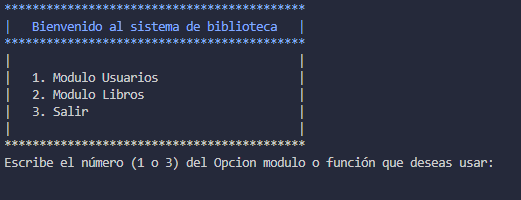
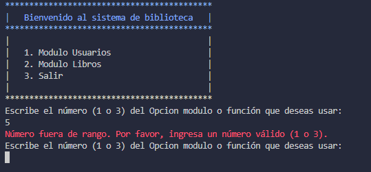
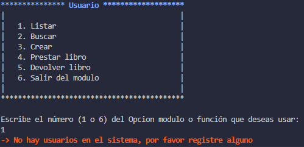

## Proyecto Biblioteca (CLI)

Se trata de un proyecto básico de biblioteca desarrollado como una Interfaz de Línea de Comandos (CLI), que gestiona usuarios y libros para realizar préstamos.

La biblioteca CLI ofrece una interfaz intuitiva para administrar tanto los usuarios como los libros disponibles en la biblioteca. Los usuarios pueden realizar diversas acciones, como registrar nuevos usuarios, agregar libros al inventario, buscar libros por título o autor, y realizar préstamos de libros.

Este proyecto es útil para la gestión eficiente de una biblioteca pequeña o mediana, proporcionando una manera fácil de llevar un registro de los libros disponibles, así como de los usuarios y sus préstamos. Además, al estar implementado como una CLI, permite una interacción rápida y directa con el sistema, lo que lo hace ideal para usuarios que prefieren la línea de comandos.

